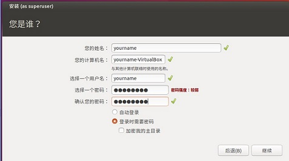

## Windows上搭建k8s单机环境 minkube

#### 1. 安装Oracle VM VirtualBox


[VirtualBox下载地址](https://download.virtualbox.org/virtualbox/5.2.6/VirtualBox-5.2.6-120293-Win.exe)

#### 2. 使用VirtualBox创建Ubuntu虚拟机


#### 3. 下载Ubuntu镜像
[ubuntu-16.04.3-desktop-amd64.iso下载地址](http://old-releases.ubuntu.com/releases/16.04.3/ubuntu-16.04.3-desktop-amd64.iso)


#### 4. 启动yourname虚拟机
会弹出如下窗口，选择本地下载的ubuntu-16.04.3-desktop-amd64.iso, 然后点启动


语言选择中文，点击安装Ubuntu按钮


都选下一步，设置用户名，密码，然后继续下一步



需要等待一会，会有安装完成，重启的提示，点击重启。
重启完成后通过sudo passwd 设置root密码 


#### 5. 设置代理


docker替换方案
```sh
docker pull registry.cn-hangzhou.aliyuncs.com/google-containers/kubernetes-dashboard-amd64:v1.8.0
docker tag registry.cn-hangzhou.aliyuncs.com/google-containers/kubernetes-dashboard-amd64:v1.5.0 gcr.io/google_containers/kubernetes-dashboard-amd64:v1.8.1
docker rmi gcr.io/google_containers/kubernetes-dashboard-amd64:v1.8.1
```
minikube替换方案
```sh
手动下载安装需要的文件到 ~/.minikube/cache
```

#### 6. 共享粘贴板和文件夹
点击VirtualBox软件的“设备”，在弹出设备菜单里点击“共享粘贴板“，在其弹出菜单栏点击“双向”


点击共享文件夹


点击VirtualBox软件的“设备”，在弹出设备菜单里点击“安装增强功能”

[image](img/share2.jpg)

需要重启虚拟机, 通过如下命令挂载共享文件夹
```sh
sudo mkdir /mnt/myshared
sudo mount -t vboxsf sharefolder /mnt/myshared
```

#### 7. 安装docker
参考[官方安装步骤](https://docs.docker.com/install/linux/docker-ce/ubuntu/)Install Docker Engine – Community 
```console
yourname@yourname-VirtualBox:~$ history 
    1  sudo passwd
    2  sudo apt-get update
    3  sudo apt-get install     apt-transport-https     ca-certificates     curl     gnupg-agent     software-properties-common
    4  curl -fsSL https://download.docker.com/linux/ubuntu/gpg | sudo apt-key add -
    5  sudo apt-key fingerprint 0EBFCD88
    6  sudo add-apt-repository    "deb [arch=amd64] https://download.docker.com/linux/ubuntu \
        $(lsb_release -cs) \
        stable"
    7  sudo apt-get update
    8  sudo apt-get install docker-ce docker-ce-cli containerd.io
    9  apt-cache madison docker-ce
   10  sudo apt-get install docker-ce=5:19.03.1~3-0~ubuntu-xenial  docker-ce-cli=5:19.03.1~3-0~ubuntu-xenial containerd.io
   11  sudo docker images
```

显示如下界面docker安装成功


设置代理（可选的）
```
sudo mkdir /etc/systemd/system/docker.service.d
sudo vi /etc/systemd/system/docker.service.d/http-proxy.conf
```
```
    [Service]
    Environment="HTTP_PROXY=http://**.**.**.**:8080/"
    Environment="HTTPS_PROXY=https:// **.**.**.**:8080/"
    Environment="NO_PROXY=localhost,127.0.0.1,192.168.0.1"
```
```
sudo systemctl daemon-reload
sudo systemctl restart docker
```


#### 8. 安装Minikube
参考最新[官方安装文档](https://kubernetes.io/docs/tasks/tools/install-minikube/)，安装老是有问题，
估计是新版本还不稳定,喜欢捣鼓的童靴可以尝试一下. 所以这里采用之前稳定的版本。minikube v0.24.0 和kubeclt v1.93.0

##### a. 下载  [kubeclt.zip](https://github.com/BreakthrougBackEndTech/examples/blob/master/minikube/kubectl.zip)  解压， 通过共享文件夹传到虚拟机里面
```
sudo mount -t vboxsf sharefolder /mnt/myshared
cp /mnt/myshared/kubectl .
chmod +x ./kubectl & sudo mv ./kubectl /usr/local/bin/kubectl
```

##### b. 安装VirtualBox
```
 wget -q https://www.virtualbox.org/download/oracle_vbox_2016.asc -O- | sudo apt-key add -
 wget -q https://www.virtualbox.org/download/oracle_vbox.asc -O- | sudo apt-key add -
 sudo apt-get update
 sudo apt-get install virtualbox
```

Tips：如果发现apt被锁定， 执行下面两条命令
```
sudo rm /var/cache/apt/archives/lock
sudo rm /var/lib/dpkg/lock
```

##### c. 下载Minikube  
```
curl -Lo minikube https://storage.googleapis.com/minikube/releases/v0.24.0/minikube-linux-amd64 && chmod +x minikube && sudo mv minikube /usr/local/bin/
```

##### d. 启动Minikube
```
sudo minkube start
```
第一次启动会下载ISO和localkube，需要一点时间，如果没有代理，记得大招 ~/.minikube/cache


看到下面的结果， 收工


